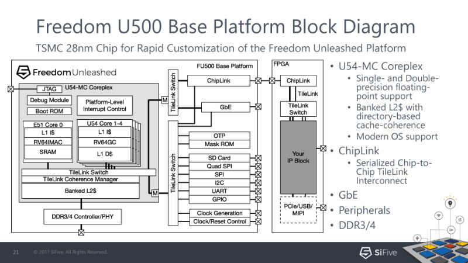

{
    "author": {
        "name": "晓阳",
    },
    "departments": [
        {
            "name": "HDU",
            "url": "https://www.hdu.edu.cn/",
            "img": "./static/hdu.png"
        }
    ]
}

+++++

# 总线 (BUS)

---

## 什么是总线 (BUS)

> In computer architecture, a bus is a communication system that transfers data between components inside a computer, or between computers. This expression covers all related hardware components and software, including communication protocols.

- 抽象的是: 总线并不是一条"线"，而是一种通信协议规范，就像 ISA 一样，是需要软件硬件协同的一种规范。
--
- 更抽象的是: BUS 属实让人眼前一黑，读读机翻你就老实了，虽然确实是数据的"公交车"🤣

广义总线:

- USB (通用串行总线) / 雷电接口 (Thunderbolt interface)
- TCP/IP

---

# 狭义的总线 - 硬件模块间的通信协议

----

## 为什么需要总线

--

### <red>模块间需要通信</red>

- 不同的计算机通过互联网通信
--
- 软件之间需要通信(前端、后端)
--

```plain
+-----+      +-------------------+      +---------------+
| CPU | <==> | Memory Controller | <==> | Memory Device |
+-----+      +-------------------+      +---------------+
```

- **CPU和内存控制器通过一套协议通信**
- **内存控制器和内存颗粒通过另一套协议通信**

--

```plain
+-----+           +-----+
| IFU | inst ---> | IDU |
+-----+           +-----+
```

- **CPU内部模块也需要通过信号通信**

----

## 最简单的总线

```plain
+-----+           +-----+
| IFU | inst ---> | IDU |
+-----+           +-----+
```

主动发起通信的模块叫master(主设备), 响应通信的模块叫slave(从设备)

其实背后藏着一套通信协议

- master(IFU)往slave(IDU)发送消息(当前指令inst)
- 双方约定, 只要master发送, slave立即收到
--
- IFU并非每周期都能取到指令
    - **IDU需要等待IFU完成取指后, 才能进行译码**

----

## 集中式控制

> 也就是常见的课本上的处理器

```plain
                   +--------------+
   +-------------> |  Controller  | <--------------+
   |               +--------------+                |
   |                ^            ^                 |
   v                v            v                 v
+-----+  inst   +-----+   ...   +-----+   ...   +-----+
| IFU | ------> | IDU | ------> | EXU | ------> | WBU |
+-----+         +-----+         +-----+         +-----+
```

集中式控制 - 控制器需收集所有模块状态, 并决定如何控制各模块工作

- 可扩展性较低, 随着模块数量和复杂度提升, 控制器越来越难设计
- 各模块可能会工作多个周期(访存延迟, 除法器)/冲刷/阻塞

----

## 更真实的处理器

IFU 在一些周期可能输出无效的`inst`，IDU 在一些周期可能无法处理即将到来的`inst`:

- slave(IDU) 需要知道什么时候 master(IFU) 的信号`inst`有效
- master(IFU) 需要知道什么时候 slave(IDU) 空闲

--

```plain
+-----+ inst  ---> +-----+
| IFU | valid ---> | IDU |
+-----+ <--- ready +-----+
```

- 需要添加valid(有效)和ready(就绪)信号,  通信协议如下
    - master(IFU)往slave(IDU)发送消息(当前指令inst)
    - 双方约定, 若master发送, 则ready有效时, 才认为slave收到
    - 上述发送行为仅在valid有效时发生

----

## 更真实的处理器 (2)——分布式控制

- 异步总线:
    - 当 valid & ready 时，称为"握手"🤝
    - 当 valid & !ready 时，master 需要保持信号
    - master 的 valid 不应该依赖于 slave 的 ready，反之亦然

--

```plain
+-----+ inst  ---> +-----+  ...  ---> +-----+  ...  ---> +-----+
| IFU | valid ---> | IDU | valid ---> | EXU | valid ---> | WBU |
+-----+ <--- ready +-----+ <--- ready +-----+ <--- ready +-----+
```

- 单周期 - 每周期上游发送的消息均有效, 下游均就绪接收新消息
- 多周期 - 模块空闲时消息无效, 模块忙碌时不接收新消息, IFU收到WBU的完成信号后再取下一条指令
- 流水线 - IFU一直取指, 各模块每个周期都尝试往下游发送消息
- 乱序执行 - 下游模块有一个队列, 上游只需要把消息发到队列, 即可继续处理新消息

---

# 系统总线

```plain
                    +-----+      +-----+
                    | CPU | <==> | DEV |
                    +-----+      +-----+
```

----

## 并行总线

系统总线 = 连接处理器和存储器以及设备之间的总线

读操作：

```plain
+-----+ araddr[log2(N)-1:0] ---> +-----+
|     | arvalid             ---> |     |
|     | <---             arready |     |
| CPU | <---         rdata[31:0] | MEM |
|     | <---              rvalid |     |
|     | rready              ---> |     |
+-----+                          +-----+
```

- master发出araddr的时刻无法提前确定
- slave也不一定总是准备好接受读取请求
- slave读出rdata的时刻无法提前确定
- master也不一定总是准备好接收slave读出的数据

++++

写操作:

```plain
+-----+                          +-----+
|     | waddr[log2(N)-1:0]  ---> |     |
| CPU | wdata[31:0]         ---> | MEM |
|     | wmask[3:0]          ---> |     |
|     | wvalid              ---> |     |
+-----+                          +-----+
```

同理, 写请求也需要握手

错误请求: 读写请求可能会出错, 例如超过存储区间的边界

```plain
+-----+ <---          bresp[1:0] +-----+
| CPU | <---              bvalid | MEM |
+-----+ bready              ---> +-----+
```

----

## [AXI-Lite 总线](https://www.arm.com/architecture/system-architectures/amba/amba-4)

```plain
araddr  ---> -+             awaddr  ---> -+
arvalid --->  AR            awvalid --->  AW
<--- arready -+             <--- awready -+

<--- rdata   -+             wdata   ---> -+
<--- rresp    |             wstrb   --->  |
<--- rvalid   R             wvalid  --->  W
rready  ---> -+             <--- wready  -+

<--- bresp   -+
<--- bvalid   B
bready  ---> -+
```

- 独立的地址/控制和数据阶段
- 支持使用字节选通的未对齐数据传输。
- 独立的写入和读取数据通道，可提供低成本的直接内存访问(DMA)

---

## 串行总线

缺点:

- 传输效率低: 数据需要多周期传输
- 逻辑复杂: 需要处理时钟同步等问题

优点:

- 布线简单: 导出的引脚较少，降低了布线复杂性和成本
- 抗干扰能力强: 信号干扰较小

----

## UART

```plain
+-----+             +-----+
| TX  |  data  ---> | RX  |
+-----+             +-----+
```

UART把数据的字节按照比特顺序发送。

另一端的UART把比特组装为字节。

通信可以是单工、全双工或半双工。


----

## SPI


SPI总线总共只有4种信号:

- SCK - master发出的时钟信号, 只有1位
- SS - master发出的选择信号, 用于指定通信对象, 每个slave对应1位
- MOSI - master向slave通信的数据线, 只有1位
- MISO - slave向master通信的数据线, 只有1位

SPI 总线是全双工的。

---

# 片间总线协议

----

## SoC = System On Chip

CPU != System

SoC = CPU + 总线 + 设备(含内存)

一个现实 - 设备的属性五花八门

- 地址空间, 访问位宽, 接口协议, 可写, 可执行, 非对齐访问, 原子操作, 突发访问, 中断, DMA, 可缓存, 幂等性…

实际中还要考虑电气特性

- 有的设备无法在高频工作, 需要实现多个时钟域之间的异步通信
- 有的设备需要固定频率的时钟作为参考时钟
- 有的设备对复位顺序的先后有要求

----

## 将总线延伸到片外

一个想法: 将总线延伸到芯片外部

- 两个芯片可以在遵循同一套通信协议的情况下互相通信
- 一个芯片就可以访问其他芯片成品上的设备
- 后者一方面不占用流片面积, 从而节省流片成本
- 另一方面也可以降低验证的复杂度和流片风险

但是需要减少引脚导出的数量:

- 对引脚进行分时复用: 综合并行总线和串行总线的特点
    - 每次传输AXI请求的一部分, 通过多个周期来传输一个完整的AXI请求

----

## ChipLink

全双工, 单方向除了32个数据信号之外, 还有时钟, 复位和有效信号

标准的ChipLink协议需要占用70个引脚

可通过桥接转换实现AXI的片间传输

```plain
-------------------+     +-------------------
            chip 1 |     | chip 2
AXI <=> ChipLink <---------> ChipLink <=> AXI
                   |     |
-------------------+     +-------------------
```

数据位宽减少到8位时, 只需要占用22个引脚

- 但要付出传输带宽的代价: 需要花费更多周期才能完整传输一个请求
- 封装成本和传输效率之间的权衡

----

## ChipLink + FPGA

若对端芯片是个FPGA, 还能获得灵活的扩展能力



++++

- 只需要将设备控制器烧录到FPGA中, 芯片就可以访问这些设备
    - 只要FPGA足够高级, 可以连接现代DDR/PCI-e
    - 设备控制器有bug也不会带来灾难性的后果, 修复bug后重新烧录即可
- 缺点: 带宽低(用性能换来的灵活性)
